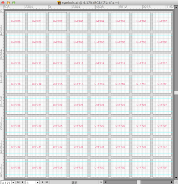
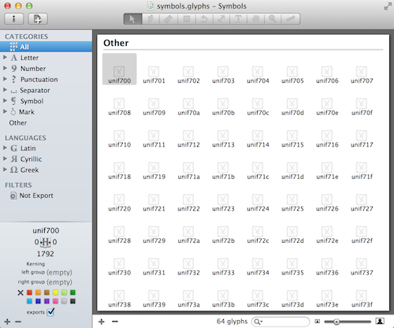

Symbols
=======

The Template of Symbol Fonts for Web.

**Caution: This repo is not maintained. [Symbols for Sketch](https://github.com/cognitom/symbols-for-sketch) has been released. Check it out!**


 &nbsp; 

## symbols.ai
This is a template file to create symbols (icons) on Illustrator CS6.

- 1792 x 1792 px : it means optimised to 14px or 28 px
- 64 documents : it means that you can create symbols on a single file)

## symbols.glyphs
This is a template file to create a font on [Glyphs mini](https://itunes.apple.com/jp/app/glyphs-mini/id469036911?l=en&mt=12) or [Glyphs](https://itunes.apple.com/jp/app/glyphs/id416987633?l=en&mt=12).

- 1792 x 1792 px : identical to the Illustrator template above.
- U+F700 ~ U+F73F are already assigned. These unicode numbers are in PUA (Private User Area).

## How to use?

0. [Download this repo](https://github.com/cognitom/symbols/archive/master.zip).
0. Create symbols on Illustrator with **symbols.ai** template.
0. Copy vector image and paste into **symbols.glyphs**.
0. Export the font to "**fonts**" directory as OTF from Glyphs mini.
0. Convert OTF to webfont formats. See [@font-face kit generator](http://fontface.codeandmore.com/indexnew.php). Put your converted fonts into "**fonts**" directory.
0. Check your font exported correctly. See **test.html**.
0. Rewrite **symbols.css** as you like :-)

## Advanced
You can generate webfonts locally. After you export the font as OTF, try following.

0. If you haven't install FontForge and other tools, install these software. See [the instruction written by mekkablue](https://github.com/mekkablue/webfontmaker).
0. Modify **Meta.xml** to add your license information.
0. Go to the directory of your repo. ```cd your/repository```
0. Execute this script. ```sh webfontmaker.sh``` Then webfont files will be automatically created in "fonts" sub directory.


## Appendix
```webfontmaker.sh``` is originally created by [mekkablue](https://github.com/mekkablue). See more detail here…

* https://github.com/mekkablue/webfontmaker